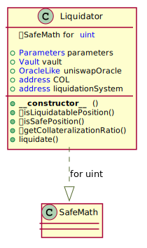

# Unit Protocol: Liquidator contract

## Overview

Manages liquidation process.

<br >


## Liquidator UML diagram

<p align="center">
  
</p>

<br >


## Is Liquidatable Position

Determines whether a position is liquidatable.

<br >


```javascript
function isLiquidatablePosition(address token, address user) public view returns (bool)
```

* token:  The address of token using as main collateral.
* user: The owner of a position.
* RETURN: whether a position is liquidatable.

<br >


## Is Safe Position

Determines whether a position is sufficiently collateralized.

<br >


```javascript
function isSafePosition(address token, address user) public view returns (bool)
```

* token:  The address of token using as main collateral.
* user: The owner of a position.
* RETURN: whether a position is sufficiently collateralized.

<br >


## Get Collateralization Ratio

Calculates position's collateral ratio.

<br >


```javascript
function getCollateralizationRatio(address token, address user) public view returns (uint)
```

* token:  The address of token using as main collateral.
* user: The owner of a position.
* RETURN: collateralization ratio of a position.

<br >


## Liquidate

Triggers liquidation process. Funds transfers directly to the liquidation system's address.


<br >


```javascript
function liquidate(address token, address user) external
```

* msg.sender: The account which shall liquidate the borrower.
* token: The address of token using as main collateral.
* user: The owner of a position.

<br >