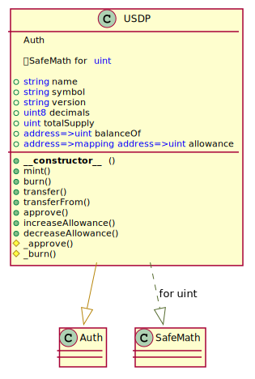

# Unit Protocol: USDP token contract

## Overview

USDP is a decentralized stablecoin currently live on the Ethereum network. The Unit Protocol incentivizes users to increase or decrease the USDP token supply based on supply and demand and ensures its value stays pegged to 1 USD.

The token contract conforms to the [ERC20 token standard](https://eips.ethereum.org/EIPS/eip-20) which allows wallets, exchanges, and other applications to easily integrate with minimal effort. Non-standard functions of USDP token are described below.

<br >


## USDP UML diagram

<p align="center">
  
</p>

<br >


## Mint

Mints tokens to address.

<br >

❗️ Only [Vault](./Vault.md) can mint USDP.

```javascript
function mint(address to, uint amount) external onlyVault
```

* msg.sender: The [Vault](./Vault.md) address.
* to: The address of the recipient.
* amount: The amount of token to be minted.

<br >


## Burn

Burns tokens from address.

<br >

❗️ Only [Vault](./Vault.md) can burn tokens from any balance.

```javascript
function burn(address from, uint amount) external onlyVault
```

* msg.sender: The [Vault](./Vault.md) address.
* from: The address of the balance owner.
* amount: The amount of token to be burned.

<br >


## Burn by Manager

Burns tokens from manager's address.

<br >

❗️ Only manager can burn tokens from manager's balance.

```javascript
function burn(uint amount) external onlyManager
```

* msg.sender: The manager's address.
* amount: The amount of token to be burned.

<br >