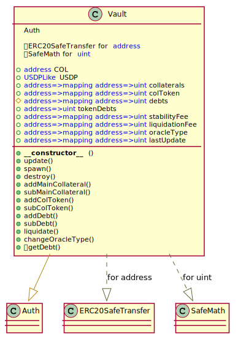

# Unit Protocol: Vault contract

## Overview

Vault is the core of USD ThePay.cash Stablecoin distribution system. Vault stores and manages collateral funds of all positions and counts debts. Only Vault can manage the supply of USDP token. 

Vault will not be changed/upgraded after initial deployment for the current stablecoin version.

<br >


## Vault UML diagram

<p align="center">
  
</p>

<br >


## Update

Updates parameters of the position to the current ones.

<br >

❗️ Needs tx's sender is able to modify the Vault – [Vault Manager](./VaultManager.md).

```javascript
function update(address token, address user) public hasVaultAccess
```

* msg.sender: The account which is able to modify the Vault – [Vault Manager](./VaultManager.md).
* token: The address of the main collateral token.
* user: The owner of a position.

<br >


## Spawn

Creates new position for user.

<br >

❗️ Needs tx's sender is able to modify the Vault – [Vault Manager](./VaultManager.md).

```javascript
function spawn(address token, address user, uint _oracleType) external hasVaultAccess
```

* msg.sender: The account which is able to modify the Vault – [Vault Manager](./VaultManager.md).
* token: The address of the main collateral token.
* user: The owner of a position.
* _oracleType: Type of using oracle pinned for this position.

<br >


## Destroy

Clears unused storage variables.

<br >

❗️ Needs tx's sender is able to modify the Vault – [Vault Manager](./VaultManager.md).

```javascript
function destroy(address token, address user) public hasVaultAccess
```

* msg.sender: The account which is able to modify the Vault – [Vault Manager](./VaultManager.md).
* token: The address of the main collateral token.
* user: The owner of a position.

<br >


## Add Main Collateral

Adds main collateral to a position.


<br >

❗️ Needs tx's sender is able to modify the Vault – [Vault Manager](./VaultManager.md).
<br >
❗️ Tokens must be pre-approved.

```javascript
function addMainCollateral(address token, address user, uint amount) external hasVaultAccess
```

* msg.sender: The account which is able to modify the Vault – [Vault Manager](./VaultManager.md).
* token: The address of the main collateral token.
* user: The owner of a position.
* amount: The amount of tokens to deposit.

<br >


## Sub Main Collateral

Withdraws main collateral from a position.

<br >

❗️ Needs tx's sender is able to modify the Vault – [Vault Manager](./VaultManager.md).

```javascript
function subMainCollateral(address token, address user, uint amount) external hasVaultAccess
```

* msg.sender: The account which is able to modify the Vault – [Vault Manager](./VaultManager.md).
* token: The address of the main collateral token.
* user: The owner of a position.
* amount: The amount of tokens to withdraw.

<br >


## Add Col Token

Adds COL token to a position.

<br >

❗️ Needs tx's sender is able to modify the Vault – [Vault Manager](./VaultManager.md).
<br >
❗️ Tokens must be pre-approved.

```javascript
function addColToken(address token, address user, uint amount) external hasVaultAccess
```

* msg.sender: The account which is able to modify the Vault – [Vault Manager](./VaultManager.md).
* token: The address of the main collateral token.
* user: The owner of a position.
* amount: The amount of tokens to deposit.

<br >


## Sub Col Token

Withdraws COL token from a position.

<br >

❗️ Needs tx's sender is able to modify the Vault – [Vault Manager](./VaultManager.md).

```javascript
function subColToken(address token, address user, uint amount) external hasVaultAccess
```

* msg.sender: The account which is able to modify the Vault – [Vault Manager](./VaultManager.md).
* token: The address of the main collateral token.
* user: The owner of a position.
* amount: The amount of tokens to withdraw.

<br >


## Add Debt

Increases position debt and mints USDP token.

<br >

❗️ Needs tx's sender is able to modify the Vault – [Vault Manager](./VaultManager.md).

```javascript
function addDebt(address token, address user, uint amount) external hasVaultAccess
```

* msg.sender: The account which is able to modify the Vault – [Vault Manager](./VaultManager.md).
* token: The address of the main collateral token.
* user: The owner of a position.
* amount: The amount of USDP to borrow.

<br >


## Sub Debt

Decreases position's debt and burns USDP token.

<br >

❗️ Needs tx's sender is able to modify the Vault – [Vault Manager](./VaultManager.md).

```javascript
function subDebt(address token, address user, uint amount) external hasVaultAccess
```

* msg.sender: The account which is able to modify the Vault – [Vault Manager](./VaultManager.md).
* token: The address of the main collateral token.
* user: The owner of a position.
* amount: The amount of USDP to repay.

<br >


## Liquidate

Deletes position and transfers collateral to liquidation system.

<br >

❗️ Needs tx's sender is able to modify the Vault – [Vault Manager](./VaultManager.md).

```javascript
function liquidate(address token, address user, address liquidationSystem) external hasVaultAccess
```

* msg.sender: The account which is able to modify the Vault – [Vault Manager](./VaultManager.md).
* token: The address of the main collateral token.
* user: The owner of a position.
* liquidationSystem: The address of an liquidation system.

<br >


## Change Oracle Type

Changes broken oracle type to the correct one.

<br >

❗️ Only manager can call this function.

```javascript
function changeOracleType(address token, address user, uint newOracleType) external onlyManager
```

* msg.sender: The manager address account.
* token: The address of the main collateral token.
* user: The owner of a position.
* newOracleType: The new type of using oracle pinned for this position.

<br >


## Get Debt

Calculates the amount of debt based on elapsed time.

<br >


```javascript
function getDebt(address token, address user) public view returns (uint)
```

* msg.sender: The account which is able to modify the Vault – [Vault Manager](./VaultManager.md).
* token: The address of the main collateral token.
* user: The owner of a position.
* RETURN: The amount of debt.

<br >