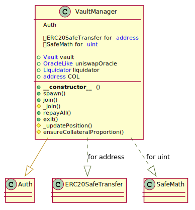

# Unit Protocol: Vault Manager contract

## Overview

\<text>

<br >


## Vault Manager UML diagram

<p align="center">
  
</p>

<br >


## Spawn

Spawns new positions. Deposits collaterals to non-spawned positions and borrows USDP.

<br >

❗️ Cannot be used for already spawned positions.
<br >
❗️ Token using as main collateral must be whitelisted.
<br >
❗️ Depositing tokens must be pre-approved to Vault contract address.

```javascript
function spawn(address token, uint mainAmount, uint colAmount, uint usdpAmount, uint oracleType) external
```

* msg.sender: The account which shall supply the assets, and own the minted USDP tokens.
* token: The address of token using as main collateral.
* mainAmount: The amount of main collateral token to deposit.
* colAmount: The amount of COL token to deposit.
* usdpAmount: The amount of USDP token to borrow.
* oracleType: The type of an oracle. Initially, only Uniswap is possible (1).

<br >


## Join

Deposits collaterals to already spawned positions and borrows USDP.

<br >

❗️ Position should be spawned (USDP minted) to call this method.
<br >
❗️ Token using as main collateral must be whitelisted.
<br >
❗️ Depositing tokens must be pre-approved to Vault contract address.

```javascript
function join(address token, uint mainAmount, uint colAmount, uint usdpAmount) external
```

* msg.sender: The account which shall supply the assets, and own the minted USDP tokens.
* token: The address of token using as main collateral.
* mainAmount: The amount of main collateral token to deposit.
* colAmount: The amount of COL token to deposit.
* usdpAmount: The amount of USDP token to borrow.

<br >


## Repay All

Repays total debt and withdraws collaterals.

<br >

❗️ Tx sender must have a sufficient USDP balance to pay the debt.
<br >
❗️ Token approwal is NOT needed.

```javascript
function repayAll(address token, uint mainAmount, uint colAmount) external
```

* msg.sender: The account to which redeemed funds shall be transferred.
* token: The address of token using as main collateral.
* mainAmount: The amount of main collateral token to withdraw.
* colAmount: The amount of COL token to withdraw.

<br >


## Exit

Withdraws collateral and repays specified amount of debt.


<br >

❗️ Tx sender must have a sufficient USDP balance to pay the debt.
<br >
❗️ Token approwal is NOT needed.

```javascript
function exit(address token, uint mainAmount, uint colAmount, uint usdpAmount) public
```

* msg.sender: The account to which redeemed funds shall be transferred.
* token: The address of token using as main collateral.
* mainAmount: The amount of main collateral token to withdraw.
* colAmount: The amount of COL token to withdraw.
* usdpAmount: The amount of USDP token to repay.

<br >